# 🛡️Sistema de Gestão AVCB - BRasas   
### *Desenvolvimento de Sistemas de Prevenção e Combate a Incêndio*

O projeto *AVCB (Auto de Vistoria do Corpo de Bombeiros)* foi desenvolvido para a empresa fictícia BRasas, com o objetivo de centralizar e automatizar a gestão de processos, usuários e documentos técnicos. O sistema permite o acompanhamento de vistorias, controle de pendências e armazenamento seguro de laudos e declarações.

## 🏗️ Arquitetura Utilizada

O sistema utiliza uma arquitetura modular em PHP focada em segurança e separação de responsabilidades:

- **Configurações:** Centralização de variáveis globais e conexão com o banco de dados.
- **Processamento (Action Scripts):** Arquivos dedicados exclusivamente à lógica de backend (cadastro, edição, exclusão e autenticação).
- **Interface (Sistema):** Dashboard dinâmico que carrega componentes via parâmetros de URL (?page=).
- **Persistência:** Uso de PDO (PHP Data Objects) para comunicação segura com o banco de dados.
- **Serviços Externos:** Integração com PHPMailer para disparos de e-mails via SMTP.
- **Util:** Classes auxiliares como Conexão e Sessão.

## 🔧 Funcionalidades Implementadas

### 👤 **Autenticação**
- Login com validação de cradenciais com criptografia **MD5**.
- **Primeiro Acesso:** Fluxo obrigatório de definição de senha definitiva para novos usuários
- **Recuperação de Senha:** Geração de senha temporária enviada automaticamente por e-mail.

### 📂 **Gestão de Documentos(CRUD)**
- Upload de arquivos (PDF e Imagens) com limite de tamanho (5MB).
- Geração de **Código Idenficiador Único** (Ex.: DOC-XXXX).
- Organização por tipos: Auto de Vistoria, Declaração, Parecer e Laudo.

### 📂 **Gestão de Processos(Gestor)**
- Cadastro de processos vinculados obrigatoriamente a um cliente.
- Controle de status: _Em análise, Pendente, Aprovado, Reprovado e Finalizado._
- Histórico descritivo de detalhes técnicos e ocorrências.

### 👥 **Gestão de Usuários (Adm/Gestor)**
- Suporte dinâmico para Pessoa Física (CPF) e Pessoa Jurídica (CNPJ).
- Cadastro completo: Dados fiscais, endereços, representantes legais e informações comerciais.
- Exclusão em cascata: Remove usuários e seus respectivos processos/documentos via transação SQL.

### 🔐 **Níveis de Acesso**
- **Administrador (1):** Gestão total de usuários, permissões e documentos globais.
- **Cliente (2):** Visualização de processos ativos e upload de documentos próprios.
- **Gestor (3):** Focado na operação; gerencia processos e cadastros de clientes.

## 🚀 Tecnologias Utilizadas

- **PHP 8.2.12**
- **MySQL/PHPMyAdmin** (Banco de Dados)
- **Apache** (Servidor Web)
- **Bootstrap 5** (Interface Responsiva)
- **SweetAlert2** (Feedbacks Visuais)
- **PHPMailer** (Notificações por E-mail)

## 🗄️ Estrutura do Banco de Dados

O projeto inclui:

- **Modelo Entidade-Relacionamento (ER)**  
- **Dicionário de Dados**  
- **Scripts SQL de criação e manutenção**

## 📸 Capturas de Tela

### Tela de Início
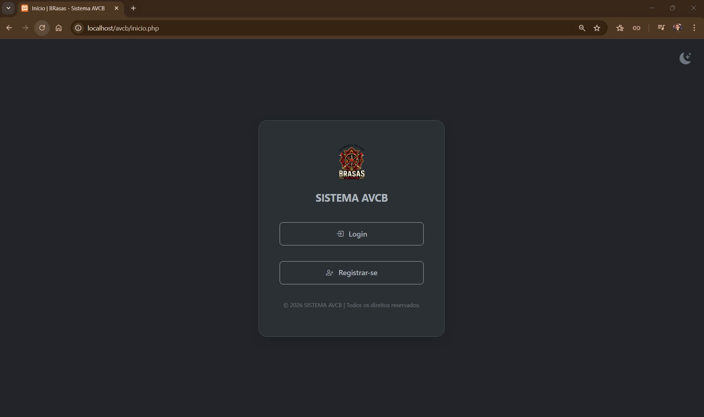

### Tela de login
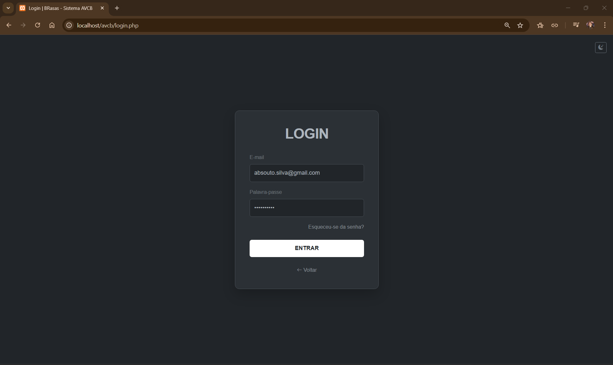

### Tela de Registra-se
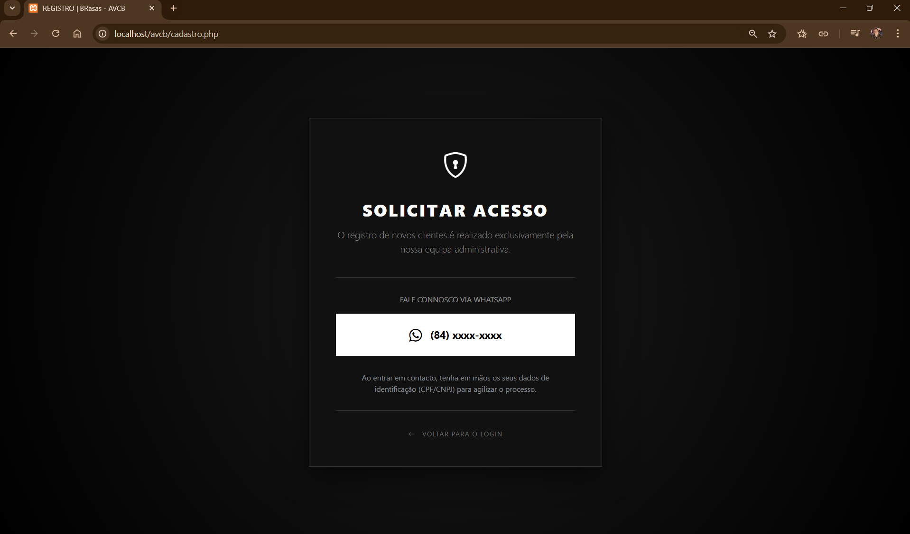

### Dashboard
> *Adminsitrador*  
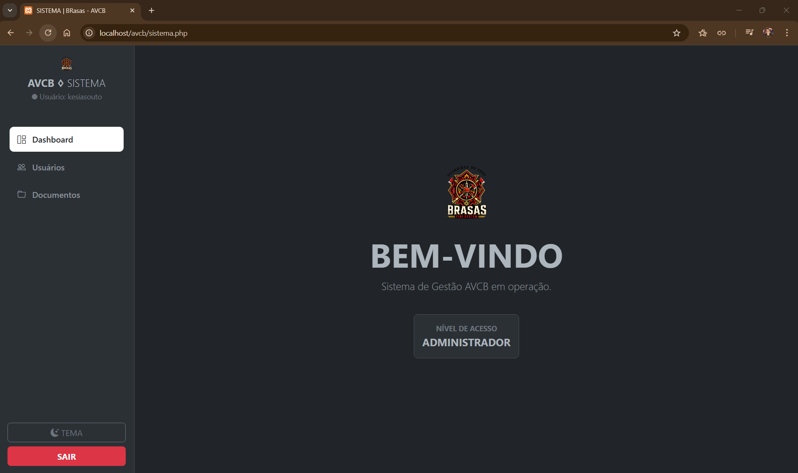

> *Gestor*  
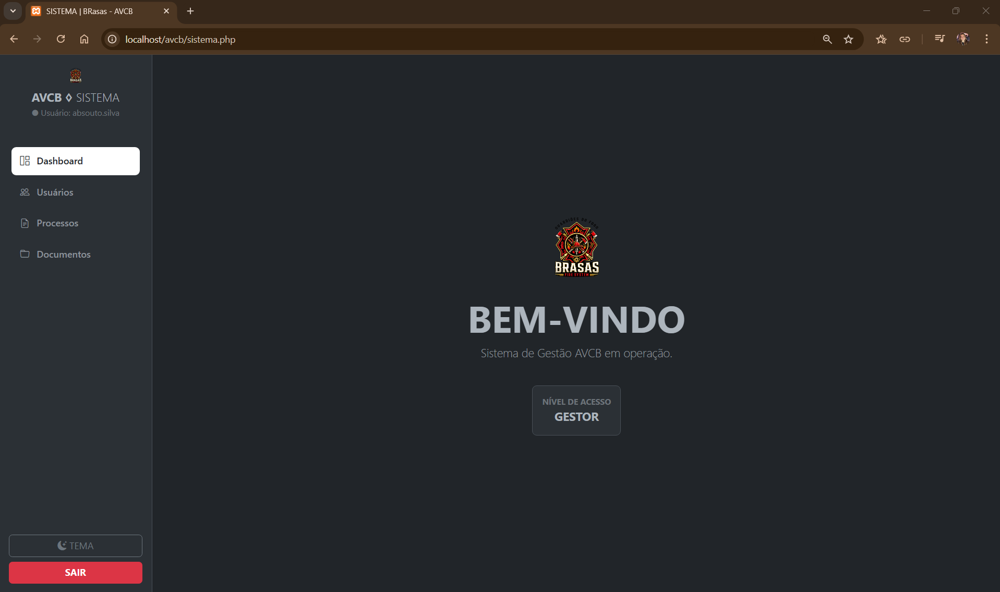

> *Cliente*  

### Telas de Usuários
> *Adminsitrador*  
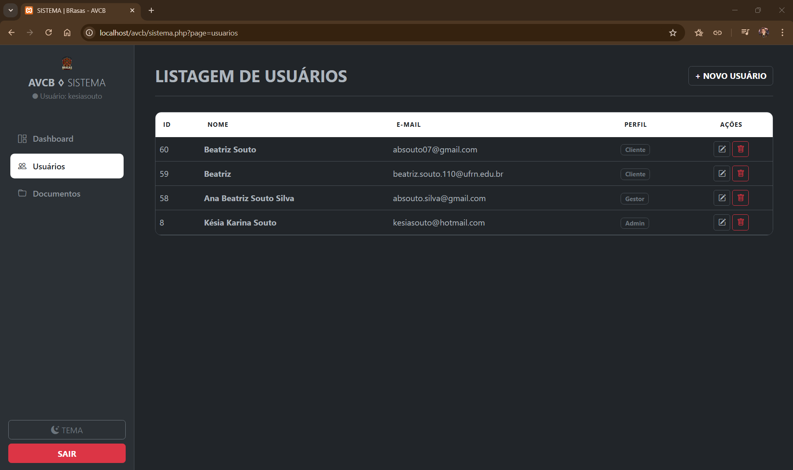

> *Gestor*  
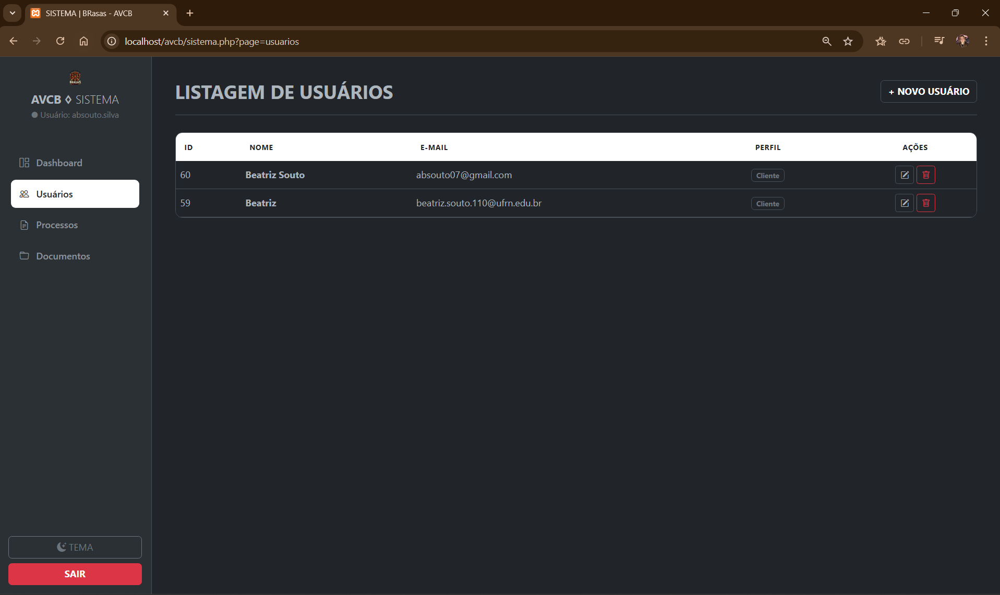

### Tela de Usuários | Cadastro (Gestor) 
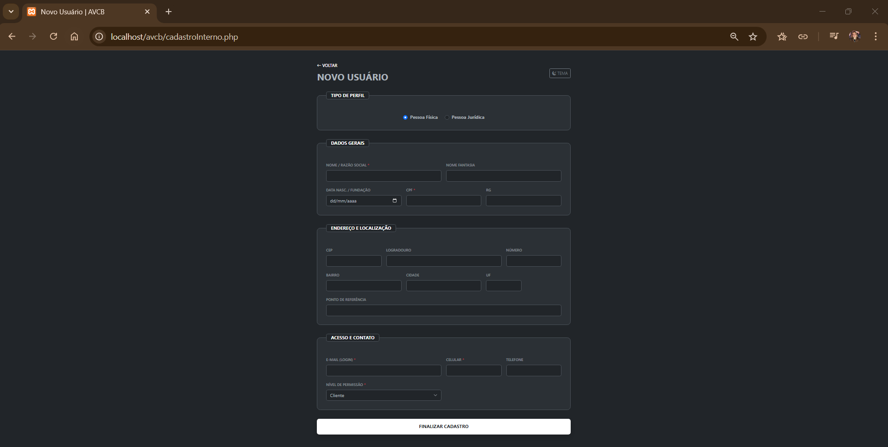

### Tela de Documento
> *Administrador*  
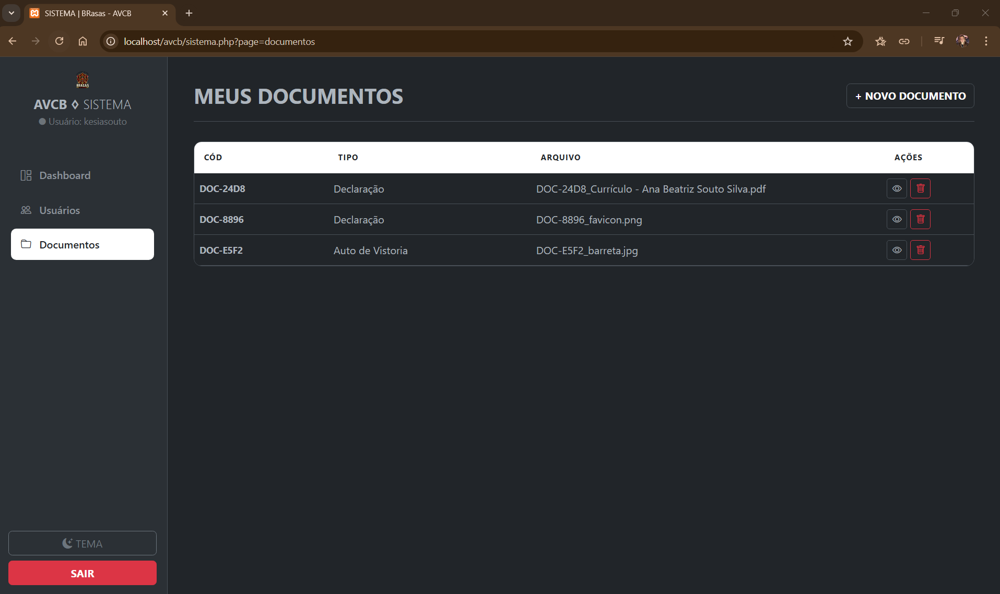

> *Cadastro Documento*  
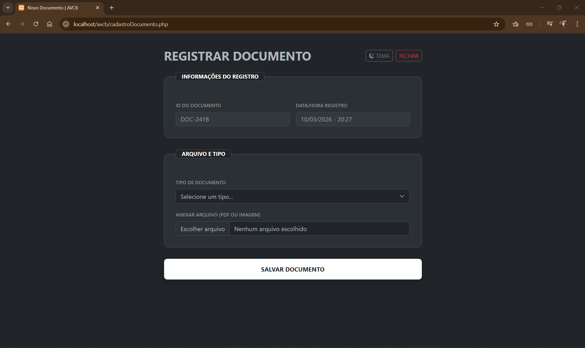

### Telas de Processos
> *Gestor* 
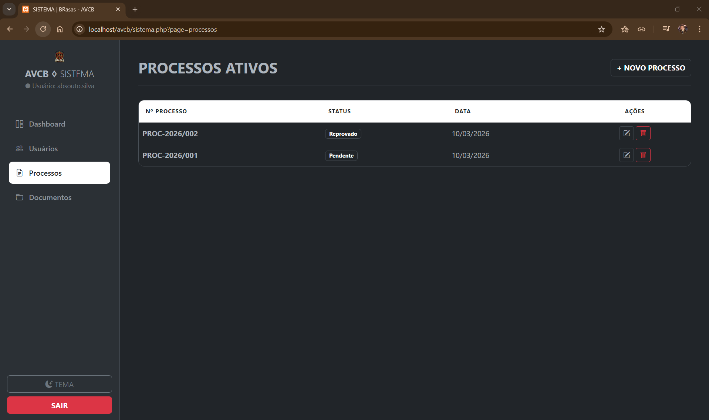

> *Cliente*  
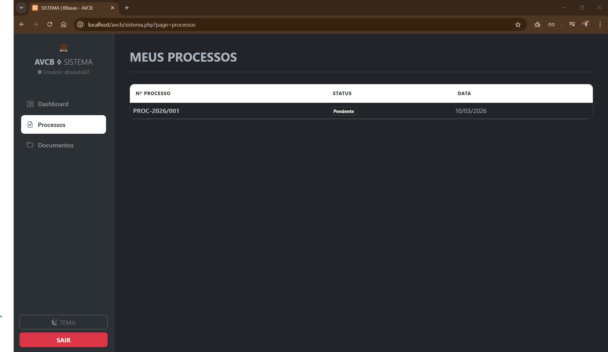

> *Cadastro Processo*  
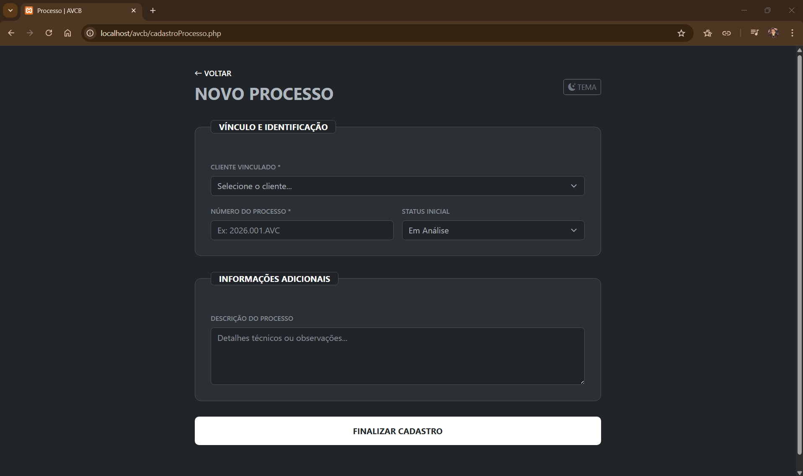

## 📊 Diagrama e Dicionário de Dados
- [**Diagrama Banco de Dados**](docs/diagrama-bd.png)
- [**Dicionário de Dados**](docs/dicionario-de-dados.md)

## 👤 Desenvolvedor

Este projeto foi desenvolvido por: [**Beatriz Souto**](https://github.com/beatrizsouto3).